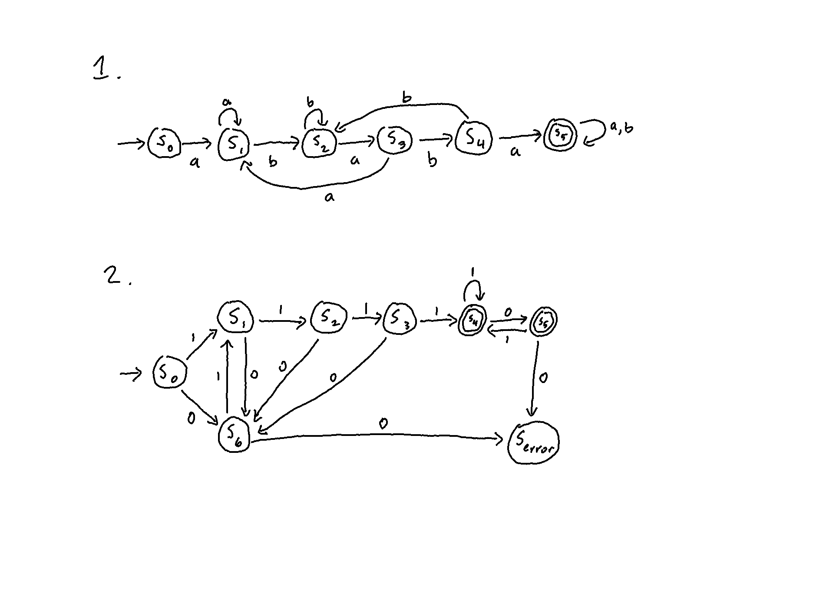
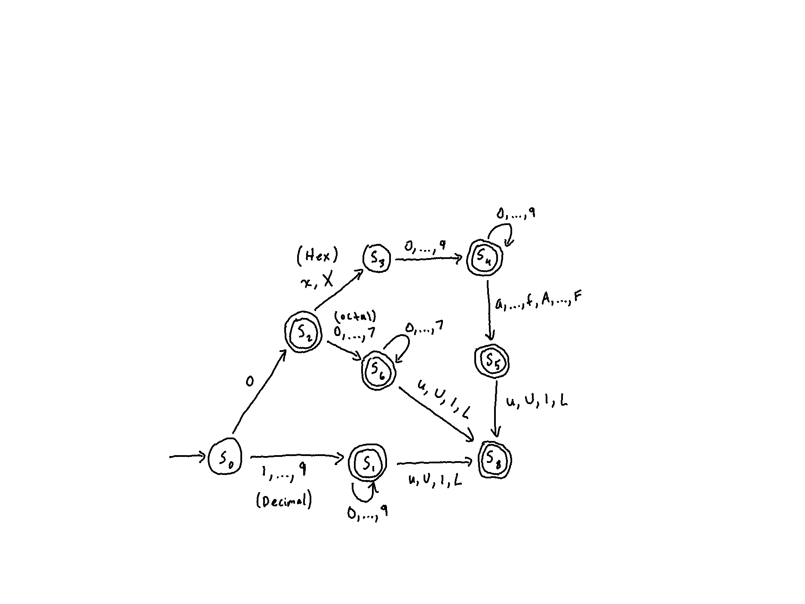

# Problem 1

$(\text{to(m|y)})^+$
1. Example strings
	1. `toy`
	2. `toytoy`
2. Example invalid strings
	1. `otm`
	2. `tomy`
3. English description:
```
One or more repetitions of a word consisting of the characters 'to' followed by either 'm' or 'y'.
```


$\text{h(i|o)(pity)}^*$
1. Example valid strings
	1. `hi`
	2. `hipitypity`
2. Example invalid strings
	1. `hio`
	2. `hiytiph`
3. English description:
```
A single 'h' followed by either 'i' or 'o' in turn followed by zero or more occurrences of the word 'pity'
```


$((\epsilon|206)299)^?$
1. Example valid strings
	1. `206299`
	2. `299`
2. Example invalid strings
	1. `299206`
	2. `206299206299`
3. English description:
```
Either an empty string or '206' followed by '299' together occurring zero or one times.
```

# Problem 2

1. All strings of d's and e's with at least 3 d's
$$(d|e)^* d (d|e)^* d (d|e)^* d (d|e)^*$$

2. All strings of d's and e's where e's only appear in sequences whose length is a multiple of 2 (e.g. deeed, eeeedeeddd, d and ε are in this set; ded, e, deded, and deede are not).

$$(d|ee|\epsilon)^*$$

3. All strings of lower-case letters that contain the 5 vowels (aeiou) exactly once and in that order, with all other possible sequences of lower-case letters before, after, or in between the individual vowels.

$$
(\alpha)^*
a
(\alpha)^*
e
(\alpha)^*
i
(\alpha)^*
o
(\alpha)^*
u
(\alpha)^*
$$
- where $\alpha = b|..|d|f|..|h|j|..|n|p|..|t|v|..|z$

# Problem 3

a. 
```
All languages that consist of a's and b's where:

1. if the string starts with the letter a or contains two consective a's, then it is followed by an infinite chain of a's and b's in any order and the accepting state is never reached.

2. if the string starts with the letter b, then it is in the accepting state and can be followed by any number of b's which can be followed by individual a's (but never more than 1 consecutively).
```

b. 
```
All languages that consist of any number of consecutive 0's and 1's and that contain at least one occurrence of either 00 or 11.
```

# Problem 4


# Problem 5

1. 
$$
(0([0-7])^*(u|U|l|L)^?)|
([1-9]([0-9])^*(u|U|l|L)^?)|
(((0x)|(0X))([0-9]|[a-f]|[A-F])^*(u|U|l|L)^?)
$$

**Octal**:
$0([0-7])^*(u|U|l|L)^?$

**Decimal**:
$[1-9]([0-9])^*(u|U|l|L)^?$

**Hexadecimal**:
$((0x)|(0X))(([0-9])|([a-f])|([A-F]))^*(u|U|l|L)^?$

2.  



# Problem 6
$$
(/*)
((*[\wedge/])|(/)|[a-z]|[0-9]|\textbackslash r|\textbackslash n|\ \ )^{*}
(*/)
$$
- Note: It's hard to tell but the last character before the closing parenthesis of the middle block (i.e. the one with the Kleene star) is supposed to be a space character.

