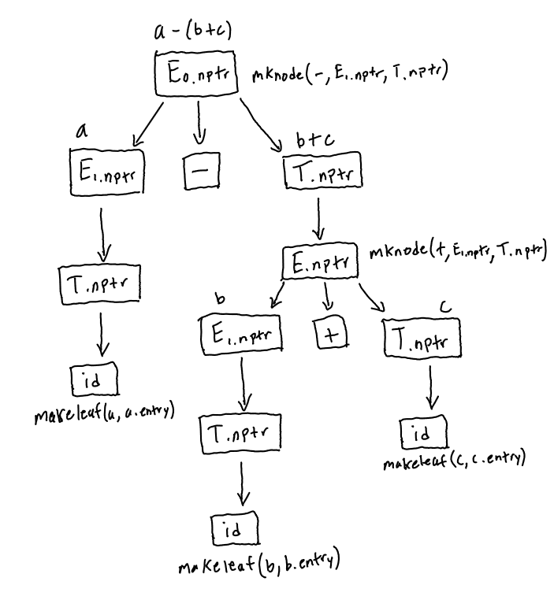

# Problem 1

(a) Grammar:

0. `exp' ::= exp $`
1. `exp ::= id`
2. `exp ::= ( exp )`
3. `exp ::= ( type ) exp`
4. `type ::= id`


$FIRST(exp) = \lbrace \ \text{id}, ( \ \rbrace$

$FIRST(exp') = FIRST(exp) = \lbrace \ \text{id}, ( \ \rbrace$

$FIRST(type) = \lbrace \ \text{id} \ \rbrace$

$FOLLOW(exp) = \lbrace \ \$, ), \text{id} \ \rbrace$

$FOLLOW(exp') = \lbrace \ \rbrace$

$FOLLOW(type) = \lbrace\  ) \ \rbrace$

$Nullable(exp) = false$

$Nullable(exp') = false$

$Nullable(type) = false$


(b) Grammar:

0. `eqns' ::= eqns $ ($ is the end-of-file marker)`
1. `eqns ::= eq sup eqns`
2. `eqns ::= eq`
3. `eq ::= x`

$FIRST(eqns) = \lbrace \ \text{x} \ \rbrace$

$FIRST(eqns') = FIRST(eqns) = \lbrace \ \text{x} \ \rbrace$

$FIRST(eq) = \lbrace \ x  \ \rbrace$

$FOLLOW(eqns) = \lbrace \ \rbrace$

$FOLLOW(eqns') = \lbrace \ \$, \text{x} \ \rbrace$

$FOLLOW(eq) = \lbrace \ \$, \text{sup}, \text{x} \ \rbrace$

$Nullable(eqns) = false$

$Nullable(eqns') = false$

$Nullable(eq) = false$

# Problem 2

(a) Symbol table at line 11:

$$
\begin{array}{lr}
\text{Symbol} & \text{Type} \\ 
\hline
\text{c} & \text{integer} \\
\text{a} & \text{integer} \\
\text{y} & \text{integer} \\
\text{z} & \text{integer} \\
\text{b} & \text{integer} \\
\text{m} & \text{integer} \\
\text{n} & \text{integer} 
\end{array}
$$


(b) Actions required for symbol table management:

When the parser enters a new procedure, it needs to create a new symbol table.
Assuming that there is a stack of symbol tables, it also needs to push the new
table onto the stack.

When the parser exits the procedure, it needs to pop the created symbol table
off of the stack of symbol tables.


# Problem 3

```
VarDecl -> var IDList: typeID
    VarDecl.env = {IDList -> (typeID, var)}

IDList -> IDList, ID
    (type, kind) = IDList.env.lookup(IDList)
    IDList.type = type
    IDList.kind = kind

IDList -> ID
    IDList.type = ID.type
    IDList.kind = ID.kind
```

Yes, this scheme can operate in a single pass of the syntax tree.


# Problem 4

Parse tree for `a - (b + c)`



# Problem 5

In order to create distinct identifiers for each function I would change the
naming scheme of each identifier so that they take the form of:

```
{function name}_{return type}_{arg 1 type}_{arg 2 type}_...
```

This ensures that each overloaded version of the function will be associated
with a unique identifier that can be easily constructed when looking up.
