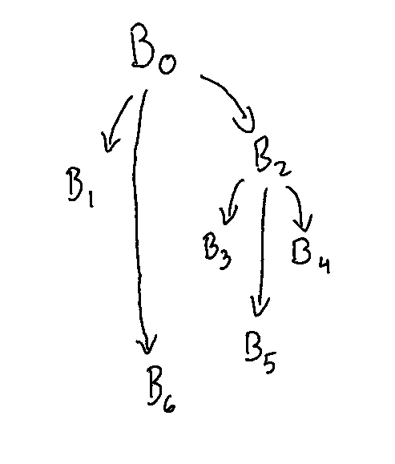

# Problem 1

Consider the following simple five-point stencil computation:
```
do 20 i = 2 , n−1 , 1
    t 1 = A( i , j −1)
    t 2 = A( i , j )
    do 10 j = 2 , m−1 , 1
        t 3 = A( i , j +1)
        A( i , j ) = 0 . 2 x ( t 1 + t 2 + t 3 + A( i −1 , j ) + A( i +1 , j ) )
        t 1 = t 2
        t 2 = t 3
10 c o n t i n u e
20 c o n t i n u e
```

Each iteration of the loop executes two copy operations.

1. Loop unrolling can eliminate the copy operations. What unroll factor is needed to eliminate all copy operations in this loop?

    The unroll factor required to eliminate all copy operations is 3 because
    the inner loop can be unrolled 3 times.

2. In general, if a loop contains multiple cycles of copy operations, how can you compute the unroll factor needed to eliminate all of the copy operations?

    According to Cooper and Torczon, the unroll factor is likely to be some
    multiple of the number of copy operations. This is because it will collapse
    those multiple copy operations into loop.


# Problem 2

<b>Dominator Tree</b>:



<b>Dominance frontier for B2</b>: $\lbrace B_5 \rbrace$

<b>Dominance frontier for B5</b>: $\lbrace \rbrace$

<b>Dominance frontier for B6</b>: $\lbrace \rbrace$

# Problem 3

$B0$:

```
use[b0] = {}
def[b0] = { a }
in[b0] = { c }
out[b0] = in[b1] U in[b2] = { a, c }
```

$B1$:

```
use[b1] = { a }
def[b1] = { b, c }
in[b1] = { a }
out[b1] = in[b3] = { b, c }
```

$B2$:

```
use[b2] = { a, c }
def[b2] = { b, c }
in[b2] = { a, c }
out[b2] = in[b3] = { b, c }
```

$B3$:

```
use[b3] = { b, c }
def[b3] = { a }
in[b3] = { b, c }
out[b3] = {}
```

# Problem 4

1. Develop an algorithm that takes as input a block b and its LiveOut set, and produces as output the Live set for each operation in the block.

    ```
    Initialize a temporary set Temp tracking the Live values for an operation
    Place all elements of LiveOut(b) in Temp
    for all operations of max(Temp) to min(b)
        remove the operation from Temp if it's in it
        add the operands of the operation to the Temp set
        Temp is now the Live set for the current operation
    ```

2. Apply your algorithm to blocks b0 and b14, given below, using LiveOut(b0) = {t3, t9} and LiveOut(b1) = {t7, t8, t9}.

    $b0$:

    ```
    1. LiveOut = { t3, t9 } -> Temp = {}
    2. Temp = { t3, t9 }
    3. Live(t9) = Temp = { t3, t6, t8 }
    4. Live(t8) = Temp = { t3, t6, t4, t7 }
    5. Live(t7) = Temp = { t3, t6, t4, a, b }
    6. Live(t6) = Temp = { t3, t4, a, b, f }
    7. Live(t5) = Temp = { t3, t4, a, b, f, e }
    8. Live(t4) = Temp = { t3, a, b, f, e }
    9. Live(t3) = Temp = { a, b, f, e, d }
    10. Live(t2) = Temp = { a, b, f, e, d, c }
    11. Live(t1) = Temp = { a, b, f, e, d, c }
    ```

    $b1$:

    ```
    1. LiveOut = { t7, t8, t9 } -> Temp = {}
    2. Temp = { t7, t8, t9 }
    3. Live(t9) = Temp = { t7, t8, t1 }
    4. Live(t8) = Temp = { t7, t1, t6, f }
    5. Live(t7) = Temp = { t1, t6, f, t4, e }
    6. Live(t6) = Temp = { t1, f, t4, e, t5 }
    7. Live(t5) = Temp = { t1, f, t4, e, d }
    8. Live(t4) = Temp = { t1, f, e, d, t3 }
    9. Live(t3) = Temp = { t1, f, e, d, t2, c }
    10. Live(t2) = Temp = { t1, f, e, d, c }
    11. Live(t1) = Temp = { f, e, d, c, a, b }
    ```

# Problem 5

$B0$:

```
a1 = 5
```

$B1$:

```
b1 = a1 + 1
c1 = 1
```

$B2$:
```
b2 = 3 + a1
c2 = b2 + c2
```

$B3$:
```
b3 = Φ(b1, b2)
c3 = Φ(c1, c2)
a2 = b3 + c3
print a2
```
